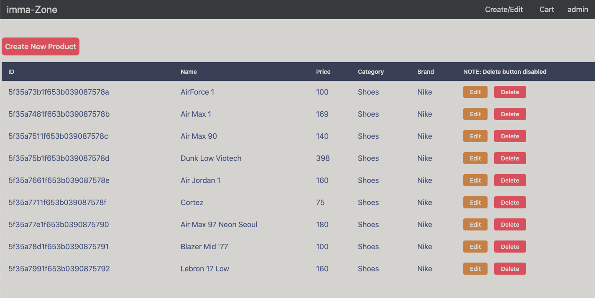

# Introduction
imma-Zone is an e-commerce clone.

# Live Link

[imma-Zone](https://e-commerce-5555-frontend.herokuapp.com/)

# Technologies

- Database management
	- MongoDB
  - Mongoose
- Front-end development
	- React
  - Redux
  - React Testing Library
  - JS-Cookie
  - CSS Grid
	- CSS
- Back-end development
	- Express.js
  - Babel
  - Nodemon
	- JWT
	- Dotenv
  - CORS

# Features

- Detail page for products
  - 
- Add products to carts
  - Subtotal updates based on quantity
  - 
- Proceed to Checkout
  - 
- Log in/register users
- Admin Demo Login
  - 
- Admin can create/edit/delete products
  - 
- Unit tests
  - 

# Future Implementation
- Search bar
- Sorting by option
- "Star" reviews
- Links to reviews
- Profile page detailing user info
- Edit user info
- Landing page
- Shopping cart badge icon indicating number of products
- Profile page displaying purchase orders